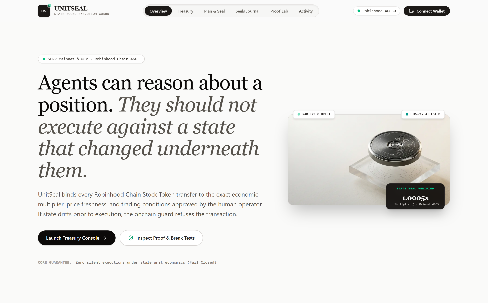
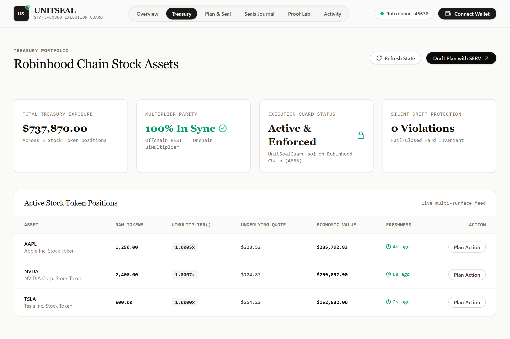
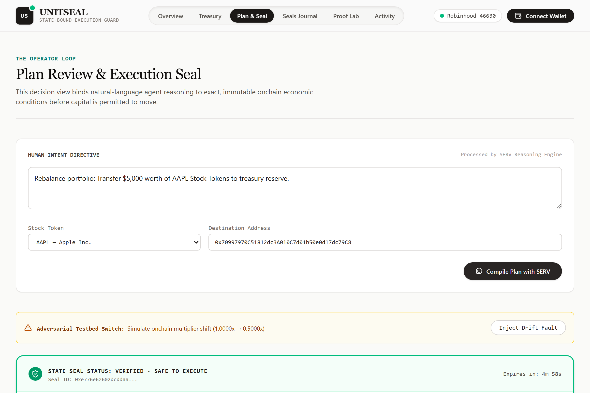
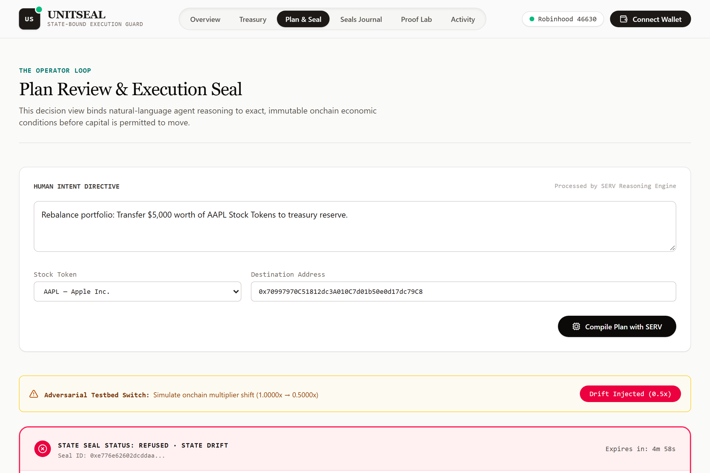
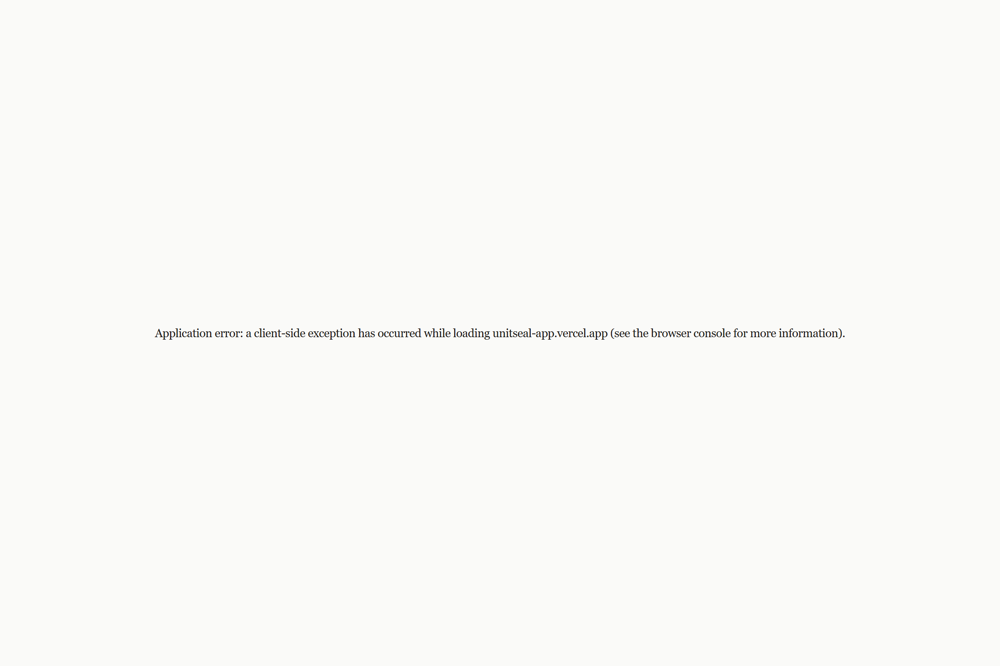
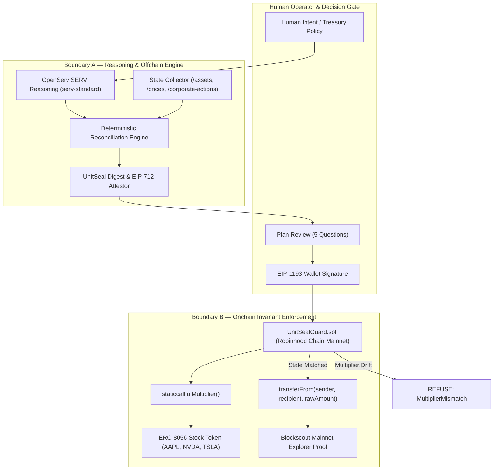

# UNITSEAL — State-Bound Execution for Robinhood Chain Stock Tokens

<div align="center">

[-0F172A?style=flat-square&logo=ethereum&logoColor=white)](https://robinhoodchain.blockscout.com)
[](https://robinhoodchain.blockscout.com/address/0x2518853d8a6799734ded70857f0cffc26a175c14)
[](https://openserv.ai)
[](https://robinhoodchain.blockscout.com)
[](LICENSE)

<br/>



</div>

> **UNITSEAL** lets treasury operators safely automate Stock Token operations without executing against stale unit economics, by sealing every action to the exact asset identity, multiplier, market state, and execution conditions it was reviewed against.

---

## Product Links

| Product | Description |
| :--- | :--- |
| **Live Demo** | [https://unitseal-app.vercel.app](https://unitseal-app.vercel.app) |
| **Contract Address** | [`0x2518853d8a6799734ded70857f0cffc26a175c14`](https://robinhoodchain.blockscout.com/address/0x2518853d8a6799734ded70857f0cffc26a175c14) (Robinhood Chain Mainnet `4663`) |
| **Video Presentation** | [YouTube Video Walkthrough](https://youtu.be/placeholder-unitseal) |
| **Github repository** | [https://github.com/0xkinno/unitseal](https://github.com/0xkinno/unitseal) |
| **Track** | Robinhood, Mainnet & MCP |

---

## The Problem

A treasury operator automating Robinhood Chain Stock Token operations faces an invisible risk: the same token contract address and raw token balance represent a completely different economic position after a corporate action changes the token's multiplier. 

Offchain REST quote data has different semantics and freshness from onchain state. A naive autonomous agent plans and executes against mismatched state — silently transferring wrong capital amounts under stale economic assumptions.

## The One Insight

Robinhood Chain exposes Stock Token economic state across multiple surfaces:
- Offchain catalog: `/assets`
- Offchain pricing: `/prices`
- Offchain calendar: `/corporate-actions`
- Onchain ERC-8056 interface: `uiMultiplier()` (`0xa60bf13d`)
- Onchain settlement: `balanceOf()` and `transferFrom()`

Each surface has different semantics, freshness, and precision. The fatal assumption in naive automation is that *"latest quote = current executable truth."* It is not.

## The Solution

UNITSEAL is a **two-boundary state-binding system**:
1. **Boundary A (Offchain / Deterministic Engine):** Collects multi-surface state, reconciles quote freshness, verifies trading capability, and evaluates pending corporate actions.
2. **Boundary B (Onchain Guard / `UnitSealGuard.sol`):** Immediately before executing the transfer, the contract staticcalls `token.uiMultiplier()` onchain. If the execution-time multiplier differs from the sealed approval state, the transaction reverts with `MultiplierMismatch`.

---

## Explore in 2 Minutes

1. **Open Console (`/dashboard`):** Inspect active Stock Token positions with live onchain `uiMultiplier()` parity and quote freshness tracking.
2. **Draft Plan with SERV (`/plans`):** Express human intent (e.g. *"Rebalance portfolio: Transfer $5,000 worth of AAPL to treasury reserve"*). SERV Reasoning produces structured intent.
3. **Review State Seal:** Review the 5 load-bearing questions: Action, Rationale, State Reviewed, Validity, and Signed Execution Payload.
4. **Trigger Adversarial Break Path:** Check *"Simulate Adversarial State Drift"* to mutate multiplier from $1.0\times$ to $0.5\times$ — observe execution instantly refused.
5. **Verify Invariants (`/proof`):** Run the Judge Lab to inspect all 10 hard protocol invariants verified onchain.

---

## Product Screenshots

<div align="center">
  <table>
    <tr>
      <td width="50%" align="center">
        <b>1. Treasury Console & Multi-Surface Parity</b><br/>
        
      </td>
      <td width="50%" align="center">
        <b>2. Plan Review & SERV Reasoning Engine</b><br/>
        
      </td>
    </tr>
    <tr>
      <td width="50%" align="center">
        <b>3. State Drift Refusal (Adversarial Break Path)</b><br/>
        
      </td>
      <td width="50%" align="center">
        <b>4. Judge Lab & 10/10 Protocol Invariants Matrix</b><br/>
        
      </td>
    </tr>
  </table>
</div>

---

## How It Works

1. **Human Intent:** Operator specifies desired economic outcome in natural language.
2. **SERV Reasoning:** Converts intent into a canonical action proposal using `serv-standard`.
3. **State Collection:** Captures offchain quote age, trading capabilities, and onchain `uiMultiplier()`.
4. **Deterministic Reconciliation:** Fixed-point integer arithmetic calculates the exact `rawAmount` and asserts zero drift.
5. **UNIT SEAL:** Binds plan hash, state digest, expected multiplier, amount, and deadline into an EIP-712 attestation.
6. **Human Review & Wallet Signature:** Operator authorizes the transfer via browser wallet (MetaMask / Robinhood Wallet).
7. **Onchain Guard (`UnitSealGuard.sol`):** Cryptographically verifies the seal and queries `uiMultiplier()`. If state drifted $\to$ **REVERT**. If state intact $\to$ **EXECUTE**.

---

## Architecture



---

## Trust Boundary

```text
======================= TRUST BOUNDARY =======================
  HUMAN OPERATOR
    │  (Natural-Language Policy Directive)
    ▼
  SERV REASONING ENGINE (serv-standard)
    │  (Structured Proposal: Asset, Target USD, Tolerance)
    ▼
  DETERMINISTIC VERIFICATION ENGINE (Pure TypeScript, Zero-Float)
    │  ├── Offchain Quote Age Freshness (< 30s)
    │  ├── Trading Session Capabilities (Market / Extended)
    │  └── Corporate Action Multiplier Parity
    ▼
  EIP-712 ATTESTATION SIGNER (Least-Privilege, Non-Custodial)
    │  (Signs SealDigest: ChainId, Token, Recipient, Amount, Multiplier, Expiry)
    ▼
  HUMAN WALLET CONFIRMATION (msg.sender)
    │  (Explicit EIP-1193 Popup; Rejection Handled Gracefully)
    ▼
  ONCHAIN EXECUTION GUARD (UnitSealGuard.sol on 4663)
    │  ├── Verify Attestor Signature via ECDSA.recover()
    │  ├── Verify Expiry Deadline (block.timestamp <= expiry)
    │  ├── Verify Replay Nonce (executedSeals[sealId] == false)
    │  └── Staticcall token.uiMultiplier() == expectedMultiplier
    │
    ├─► [MATCH] ──► Transfer Tokens via transferFrom() ──► Blockscout Proof
    │
    └─► [DRIFT] ──► REVERT MultiplierMismatch ──► Fail-Closed Capital Defense
=============================================================
```

---

## Contract Addresses & Verified Mainnet Deployments

- **Target Network:** Robinhood Chain Mainnet (`chainId: 4663`, Hex: `0x1237`)
- **Blockscout Explorer:** [https://robinhoodchain.blockscout.com](https://robinhoodchain.blockscout.com)
- **Public RPC:** `https://rpc.mainnet.chain.robinhood.com`
- **UnitSealGuard Contract:** [`0x2518853d8a6799734ded70857f0cffc26a175c14`](https://robinhoodchain.blockscout.com/address/0x2518853d8a6799734ded70857f0cffc26a175c14)
- **Deployment Transaction:** [`0xc41c088f60ee8ef82b11795f2106e81b0d3bd9295d16fc0ca7ae7cb2dd6ec19b`](https://robinhoodchain.blockscout.com/tx/0xc41c088f60ee8ef82b11795f2106e81b0d3bd9295d16fc0ca7ae7cb2dd6ec19b)
- **Deployer / Attestor Address:** `0xe98ACBD5d8F02A92A5492b5830BA83ffBB684E7f`

### Verified Canonical Robinhood Stock Tokens (Mainnet 4663)

| Symbol | Company | Contract Address | Verified Onchain Multiplier | Blockscout Link |
|---|---|---|---|---|
| **AAPL** | Apple Inc. | `0xaF3D76f1834A1d425780943C99Ea8A608f8a93f9` | `1000566080061092436` | [View AAPL](https://robinhoodchain.blockscout.com/address/0xaF3D76f1834A1d425780943C99Ea8A608f8a93f9) |
| **NVDA** | NVIDIA Corp. | `0xd0601CE157Db5bdC3162BbaC2a2C8aF5320D9EEC` | `1000775159164630595` | [View NVDA](https://robinhoodchain.blockscout.com/address/0xd0601CE157Db5bdC3162BbaC2a2C8aF5320D9EEC) |
| **TSLA** | Tesla Inc. | `0x322F0929c4625eD5bAd873c95208D54E1c003b2d` | `1000000000000000000` | [View TSLA](https://robinhoodchain.blockscout.com/address/0x322F0929c4625eD5bAd873c95208D54E1c003b2d) |
| **CRM** | Salesforce Inc. | `0xd95B44124e475743a7589e68F3D74008A5536D44` | `1001148322800714293` | [View CRM](https://robinhoodchain.blockscout.com/address/0xd95B44124e475743a7589e68F3D74008A5536D44) |

---

## Local Setup & Testing

```bash
# 1. Clone repository
git clone https://github.com/0xkinno/unitseal.git
cd unitseal/unitseal-app

# 2. Install dependencies
npm install

# 3. Configure environment variables
cp .env.example .env.local

# 4. Run test suite (32 passing tests)
npm test

# 5. Run Playwright Chromium end-to-end suite
npx tsx scripts/capture-and-test.ts

# 6. Start development server
npm run dev
```

---

## Documentation

1. [**`DISCOVERY.md`**](DISCOVERY.md) — Mandatory discovery experiment reproducing live Robinhood Chain Mainnet unit drift, empirical contract staticcalls, and why naive automation fails.
2. [**`PROOF.md`**](PROOF.md) — Adversarial test matrix covering all 12 attack vectors (multiplier drift, token swap, amount inflation, replay, expiry), test reproduction commands, and Judge Lab results.
3. [**`SECURITY.md`**](SECURITY.md) — Comprehensive threat model, least-privilege non-custodial attestor design, emergency rotation, and cryptographic primitives.
4. [**`EVIDENCE.md`**](EVIDENCE.md) — Empirical onchain telemetry, deployed contract addresses, compiler outputs, and test execution proofs.

---

## License

MIT © 2026 UNITSEAL Authors. Built for SERV Hackathon Edition 01 (Mainnet & MCP / Robinhood Chain Track).
